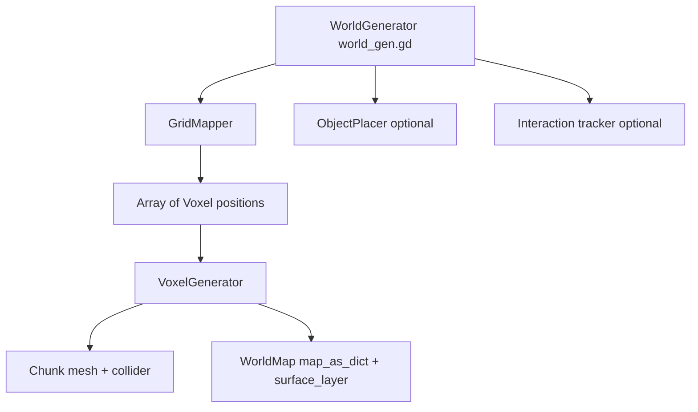

# Reusing the Voxel Hex Map Generator

This guide explains how to move generator from this project into future Godot projects with minimal guesswork.

## Scope

Generator builds hex-prism voxel terrain mesh from noise and shape settings.

- Core output: one generated `Chunk` mesh + collision.
- Optional output: villages and prototype units.
- Runtime data written to `WorldMap` singleton (`map_as_dict`, `surface_layer`, settings metadata).

## Architecture at a glance

## Required files

Copy these files as baseline generator package.

### Core scripts (required)

- `scripts/WorldGen/world_gen.gd`
- `scripts/WorldGen/grid_mapper.gd`
- `scripts/WorldGen/generation_settings.gd`
- `scripts/WorldGen/Voxel/voxel_generator.gd`
- `scripts/WorldGen/Voxel/voxel.gd`
- `scripts/WorldGen/Voxel/chunk.gd`
- `scripts/Global/world.gd`
- `scripts/Global/voxel_data.gd`
- `scripts/hit_data.gd` (used by `Chunk.voxel_at_point`)

### Resources and assets (required)

- At least one `GenerationSettings` resource, for example:
  - `Resources/GenerationSettings/test.tres`
- Material for generated mesh, referenced by `GenerationSettings.material`
- Texture atlas coordinates in `VoxelData.tile_map` must match your atlas layout

### Optional scripts (only if you need gameplay layer)

- `scripts/WorldGen/object_placer.gd`
- `scripts/pathfinder.gd`
- `scripts/interaction.gd`
- `scripts/unit.gd`

### Currently unused in runtime generation path

- `scripts/WorldGen/mapping_data.gd`
- `scripts/WorldGen/position_data.gd`

These can stay out of migration unless you plan to use them.

## Required autoloads

Add these singletons in Project Settings > Autoload:

- `VoxelData` -> `res://scripts/Global/voxel_data.gd`
- `WorldMap` -> `res://scripts/Global/world.gd`

`Debugger` autoload is optional for generator itself.

## Scene contract expected by world_gen.gd

`world_gen.gd` now supports injected dependencies for plug-and-play use.

- `chunks_root : Node3D` (required)
- `object_placer : Node` (optional)
- `interaction_tracker : Node` (optional)
- `results_label : RichTextLabel` (optional)

Fallback NodePaths are still available:

- `chunks_root_path`
- `object_placer_path`
- `interaction_tracker_path`
- `results_label_path`

Behavior toggles:

- `generate_on_ready`
- `initialize_interaction`
- `log_results_to_label`

Public API for external systems:

- `regenerate_world()`
- `world_generated(chunk, voxel_count)` signal

## Migration checklist (recommended order)

1. Copy required scripts and resources into target project.
2. Add autoloads `WorldMap` and `VoxelData`.
3. Create a scene with one node running `world_gen.gd`.
4. Assign `chunks_root` in inspector (or set `chunks_root_path`).
5. Optionally assign `object_placer`, `interaction_tracker`, and `results_label`.
6. Create or copy one `GenerationSettings` resource and assign it to `world_gen.gd`.
7. Set `GenerationSettings.material` and ensure atlas mapping in `VoxelData.tile_map` is valid.
8. Disable gameplay extras first:
   - `spawn_villages_and_units = false`
   - `initialize_interaction = false` if no interaction system in target project
9. Run generation once, verify mesh and collision.
10. Re-enable optional systems (villages, units, pathfinding) one by one.

## Generation flow details

`world_gen.gd` flow:

1. Resolve dependencies from direct exports or fallback paths.
2. Clear map state and old chunk children.
3. Apply settings and initialize random seed.
4. `GridMapper.calculate_map_positions()` builds full voxel position list by shape.
5. `VoxelGenerator.generate_chunk()`:
   - normalizes noise
   - marks air/solid from `GenerationSettings`
   - builds hex prism mesh with atlas UVs
   - updates `WorldMap` dictionaries
6. Add returned `Chunk` to `chunks_root` and initialize collider/layers.
7. Optionally place villages and units.
8. Optionally initialize interaction tracker.
9. Emit `world_generated` signal.

## Key GenerationSettings controls

- `map_shape`: `HEXAGONAL`, `RECTANGULAR`, `DIAMOND`, `CIRCLE`
- `radius`: horizontal map size
- `max_height`: voxel stack height per tile
- `noise_height_bias`: blend between noise vs height influence
- `ground_to_air_ratio`: higher value keeps more solid voxels
- `terrace_steps`: erosion-like shaping over neighbors
- `flat_buffer` and `map_edge_buffer`: controls map border trimming
- `voxel_size`, `voxel_height`: world scale
- `material`: mesh material override for generated chunk

## Common pitfalls

### 1) `chunks_root` not assigned

Generator now logs error and aborts if no `chunks_root` can be resolved.

### 2) Optional systems left enabled without dependencies

If `spawn_villages_and_units` is true but `object_placer` is missing, generator warns and skips placement.

### 3) Atlas mismatch causes wrong textures

`VoxelGenerator` uses fixed atlas constants and `VoxelData.tile_map`. If atlas dimensions, tile size, margin, or stride differ, UVs point to wrong tiles.

## Suggested hardening before reuse

For long-term reuse, consider this small refactor set:

1. Move atlas constants from `voxel_generator.gd` into configurable resource.
2. Add deterministic RNG abstraction instead of global `randi()` for fully reproducible generation sessions.
3. Add generation strategy interface if you want to swap different terrain algorithms behind same `world_gen.gd` node.

This keeps generator portable across projects with different scene trees and art pipelines.
