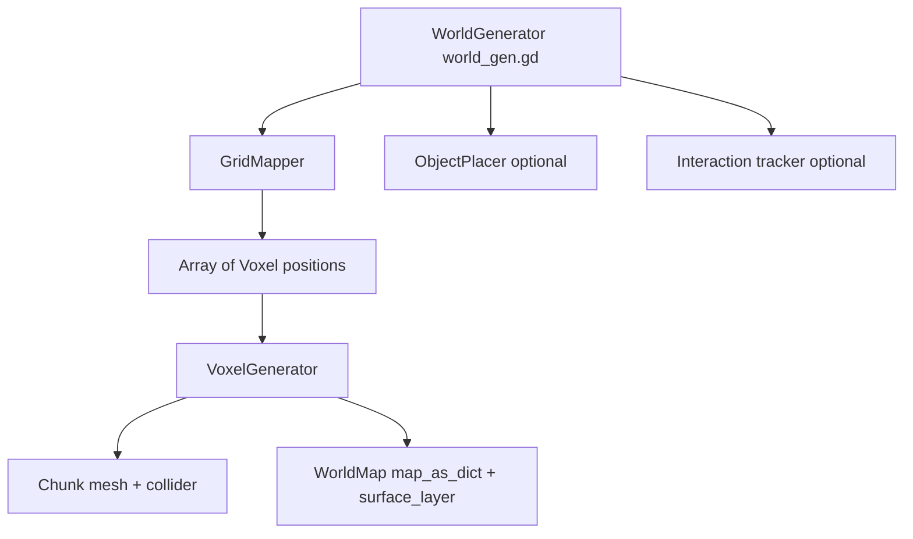

# Reusing the Voxel Hex Map Generator

This guide explains how to move generator from this project into future Godot projects with minimal guesswork.

## Scope

Generator builds hex-prism voxel terrain mesh from noise and shape settings.

- Core output: one generated `Chunk` mesh + collision.
- Optional output: villages and prototype units.
- Runtime data written to `WorldMap` singleton (`map_as_dict`, `surface_layer`, settings metadata).

## Architecture at a glance

## Required files

Copy these files as baseline generator package.

### Core scripts (required)

- `scripts/WorldGen/world_gen.gd`
- `scripts/WorldGen/grid_mapper.gd`
- `scripts/WorldGen/generation_settings.gd`
- `scripts/WorldGen/Voxel/voxel_generator.gd`
- `scripts/WorldGen/Voxel/voxel.gd`
- `scripts/WorldGen/Voxel/chunk.gd`
- `scripts/Global/world.gd`
- `scripts/Global/voxel_data.gd`
- `scripts/hit_data.gd` (used by `Chunk.voxel_at_point`)

### Resources and assets (required)

- At least one `GenerationSettings` resource, for example:
  - `Resources/GenerationSettings/test.tres`
- Material for generated mesh, referenced by `GenerationSettings.material`
- Texture atlas coordinates in `VoxelData.tile_map` must match your atlas layout

### Optional scripts (only if you need gameplay layer)

- `scripts/WorldGen/object_placer.gd`
- `scripts/pathfinder.gd`
- `scripts/interaction.gd`
- `scripts/unit.gd`

### Currently unused in runtime generation path

- `scripts/WorldGen/mapping_data.gd`
- `scripts/WorldGen/position_data.gd`

These can stay out of migration unless you plan to use them.

## Required autoloads

Add these singletons in Project Settings > Autoload:

- `VoxelData` -> `res://scripts/Global/voxel_data.gd`
- `WorldMap` -> `res://scripts/Global/world.gd`

`Debugger` autoload is optional for generator itself.

## Scene contract expected by world_gen.gd

Current `world_gen.gd` uses hardcoded relative node paths.

- `../Interaction_tracker`
- `../../Chunks`
- `../../Control/VBoxContainer/RichTextLabel`

And one exported dependency:

- `object_placer : ObjectPlacer`

If target project has different scene tree, do one of these:

1. Recreate same node structure.
2. Refactor `world_gen.gd` to exported NodePaths for chunks, label, and interaction tracker.
3. Remove optional calls (`object_placer` and `interaction_tracker`) for pure terrain-only generation.

## Migration checklist (recommended order)

1. Copy required scripts and resources into target project.
2. Add autoloads `WorldMap` and `VoxelData`.
3. Create a scene with:
   - One node running `world_gen.gd`
   - One `Chunks` `Node3D` parent target for generated chunk instances
4. Create or copy one `GenerationSettings` resource and assign it to `world_gen.gd`.
5. Set `GenerationSettings.material` and ensure atlas mapping in `VoxelData.tile_map` is valid.
6. Disable gameplay extras first:
   - `spawn_villages_and_units = false`
   - skip interaction tracker init if not present
7. Run generation once, verify mesh and collision.
8. Re-enable optional systems (villages, units, pathfinding) one by one.

## Generation flow details

`world_gen.gd` flow:

1. Clear map state and old chunk children.
2. Apply settings and initialize random seed.
3. `GridMapper.calculate_map_positions()` builds full voxel position list by shape.
4. `VoxelGenerator.generate_chunk()`:
   - normalizes noise
   - marks air/solid from `GenerationSettings`
   - builds hex prism mesh with atlas UVs
   - updates `WorldMap` dictionaries
5. Add returned `Chunk` to `Chunks` node and initialize collider/layers.
6. Optionally place villages and units.

## Key GenerationSettings controls

- `map_shape`: `HEXAGONAL`, `RECTANGULAR`, `DIAMOND`, `CIRCLE`
- `radius`: horizontal map size
- `max_height`: voxel stack height per tile
- `noise_height_bias`: blend between noise vs height influence
- `ground_to_air_ratio`: higher value keeps more solid voxels
- `terrace_steps`: erosion-like shaping over neighbors
- `flat_buffer` and `map_edge_buffer`: controls map border trimming
- `voxel_size`, `voxel_height`: world scale
- `material`: mesh material override for generated chunk

## Common pitfalls

### 1) Regeneration leaves stale `surface_layer` entries

`WorldMap.clear_map()` currently clears only `map_as_dict`, not `surface_layer`.

If you regenerate often at runtime, clear both dictionaries before new generation.

### 2) Scene tree mismatch causes null node paths

`world_gen.gd` assumes specific relative paths for UI and interaction tracker. If absent, generation may fail after mesh creation step.

### 3) Atlas mismatch causes wrong textures

`VoxelGenerator` uses fixed atlas constants and `VoxelData.tile_map`. If atlas dimensions, tile size, margin, or stride differ, UVs point to wrong tiles.

## Suggested hardening before reuse

For long-term reuse, consider this small refactor set:

1. Convert hardcoded node paths in `world_gen.gd` into exported NodePaths.
2. Split generation core from gameplay hooks (object placement and interaction init).
3. Add explicit `WorldMap.reset()` that clears all runtime dictionaries.
4. Move atlas constants from `voxel_generator.gd` into configurable resource.

This keeps generator portable across projects with different scene trees and art pipelines.
