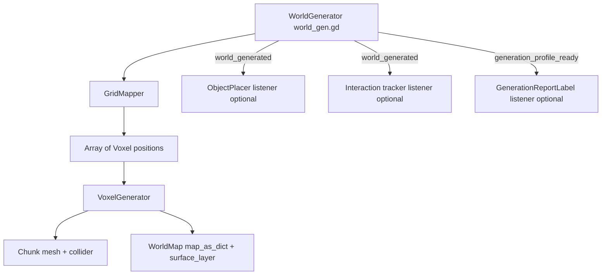

# Reusing the Voxel Hex Map Generator

This guide explains how to move generator from this project into future Godot projects with minimal guesswork.

## Scope

Generator builds hex-prism voxel terrain mesh from noise and shape settings.

- Core output: one generated `Chunk` mesh + collision.
- Optional output: villages and prototype units.
- Runtime data written to `WorldMap` singleton (`map_as_dict`, `surface_layer`, settings metadata).

## Architecture at a glance

## Required files

Copy these files as baseline generator package.

### Core scripts (required)

- `scripts/WorldGen/world_gen.gd`
- `scripts/WorldGen/grid_mapper.gd`
- `scripts/WorldGen/generation_settings.gd`
- `scripts/WorldGen/Voxel/voxel_generator.gd`
- `scripts/WorldGen/Voxel/voxel.gd`
- `scripts/WorldGen/Voxel/chunk.gd`
- `scripts/Global/world.gd`
- `scripts/Global/voxel_data.gd`
- `scripts/hit_data.gd` (used by `Chunk.voxel_at_point`)

### Resources and assets (required)

- At least one `GenerationSettings` resource, for example:
  - `Resources/GenerationSettings/test.tres`
- Material for generated mesh, referenced by `GenerationSettings.material`
- Texture atlas coordinates in `VoxelData.tile_map` must match your atlas layout

### Optional scripts (only if you need gameplay layer)

- `scripts/WorldGen/object_placer.gd`
- `scripts/WorldGen/Spawn/spawn_settings.gd`
- `scripts/WorldGen/Spawn/voxel_weight_strategy.gd`
- `scripts/WorldGen/Spawn/default_voxel_weight_strategy.gd`
- `scripts/WorldGen/Spawn/village_spawn_component.gd`
- `scripts/WorldGen/Spawn/unit_spawn_component.gd`
- `scripts/pathfinder.gd`
- `scripts/interaction.gd`
- `scripts/WorldGen/generation_report_label.gd`
- `scripts/unit.gd`

### Optional spawn resources

- `Resources/SpawnSettings/default_spawn_settings.tres`

### Currently unused in runtime generation path

- `scripts/WorldGen/mapping_data.gd`
- `scripts/WorldGen/position_data.gd`

These can stay out of migration unless you plan to use them.

## Required autoloads

Add these singletons in Project Settings > Autoload:

- `VoxelData` -> `res://scripts/Global/voxel_data.gd`
- `WorldMap` -> `res://scripts/Global/world.gd`

`Debugger` autoload is optional for generator itself.

## Scene contract expected by world_gen.gd

`world_gen.gd` now supports injected dependencies for plug-and-play use.

- `chunks_root : Node3D` (required)

Fallback NodePaths are still available:

- `chunks_root_path`

Behavior toggles:

- `generate_on_ready`

Public API for external systems:

- `regenerate_world()`
- `world_generated(chunk, voxel_count)` signal
- `generation_profile_ready(profile)` signal

## Variable reference (exported)

### `world_gen.gd`

- `settings`: `GenerationSettings` resource used for current generation run.
- `chunks_root`: `Node3D` parent receiving generated chunk instances.
- `chunks_root_path`: fallback path used to resolve `chunks_root` if unset.
- `generate_on_ready`: if true, auto-start generation in `_ready()`.

### `object_placer.gd`

- `world_generator`: signal source for `world_generated`.
- `world_generator_path`: fallback path for resolving `world_generator`.
- `auto_connect`: if true, listener auto-connects in `_ready()`.
- `spawn_settings`: data-driven `SpawnSettings` resource used by spawn pipeline.
- `village_spawn_component`: component that plans village tiles.
- `village_spawn_component_path`: fallback path for village component.
- `unit_spawn_component`: component that resolves/spawns units.
- `unit_spawn_component_path`: fallback path for unit component.
- `auto_create_spawn_modules`: creates default settings/components when missing.
- `village`: village scene spawned on valid placeable voxels.
- `proto_unit`: unit scene used for starting unit placement.

### `spawn_settings.gd`

- `use_generation_spawn_toggle`: use `GenerationSettings.spawn_villages_and_units` as master toggle.
- `spawn_enabled_override`: manual master toggle if generation toggle is ignored.
- `village_spawn_mode`: spacing fill or target-count village planning.
- `village_spacing_override`: override spacing (`-1` uses generation spacing).
- `dynamic_village_target`: enables placeable-count-scaled village target.
- `fixed_village_target`: fallback target when dynamic target is disabled.
- `villages_per_placeable_tile`: dynamic village density ratio.
- `max_dynamic_village_target`: cap for dynamic village target.
- `use_weighted_village_selection`: enables weighted village candidate ordering.
- `min_village_weight`: cutoff threshold for weighted village eligibility.
- `weighting_profile`: preset weighting style for placeholder scoring.
- `custom_center_weight`, `custom_noise_weight`, `custom_solidity_weight`: custom profile factors.
- `unit_spawn_mode`: radius-based, fixed, or per-village unit count mode.
- `fixed_unit_count`: explicit unit count for fixed mode.
- `units_per_village`: dynamic ratio for per-village unit mode.
- `max_dynamic_unit_count`: cap for per-village unit mode.
- `max_unit_spawn_attempts_per_unit`: unit placement safety attempts multiplier.

### `village_spawn_component.gd`

- `weight_strategy`: pluggable resource implementing `VoxelWeightStrategy`.
- `auto_create_default_weight_strategy`: fallback to `DefaultVoxelWeightStrategy` when no strategy is assigned.

### `unit_spawn_component.gd`

- No exported fields yet; behavior is configured through `SpawnSettings`.

### `interaction.gd`

- `world_generator`: signal source for initialization after generation.
- `world_generator_path`: fallback path for resolving `world_generator`.
- `auto_connect_world_generator`: auto-connect behavior for generation listener.
- `voxel_cursor_scene`: scene used for voxel cursor visuals.
- `unit_cursor_scene`: scene used for unit cursor visuals.
- `main_camera`: camera used for click raycasting.
- `p_finder`: pathfinder used for reachable-tiles highlighting.
- `selection_indicator`: UI texture swapped between select/build modes.

### `generation_report_label.gd`

- `world_generator`: signal source for generation timing profile updates.
- `world_generator_path`: fallback path for resolving `world_generator`.
- `auto_connect`: if true, listener auto-connects in `_ready()`.
- `seconds_threshold_ms`: threshold for switching total duration display from ms to seconds.

## Migration checklist (recommended order)

1. Copy required scripts and resources into target project.
2. Add autoloads `WorldMap` and `VoxelData`.
3. Create a scene with one node running `world_gen.gd`.
4. Assign `chunks_root` in inspector (or set `chunks_root_path`).
5. Add optional listeners you need:
   - `ObjectPlacer` listening to `world_generated`
   - configure `ObjectPlacer.spawn_settings` (resource)
   - `Interaction_tracker` listening to `world_generated`
   - `GenerationReportLabel` listening to `generation_profile_ready`
6. Create or copy one `GenerationSettings` resource and assign it to `world_gen.gd`.
7. Set `GenerationSettings.material` and ensure atlas mapping in `VoxelData.tile_map` is valid.
8. Disable gameplay extras first:
   - `spawn_villages_and_units = false`
   - or set `SpawnSettings.use_generation_spawn_toggle = false` and `spawn_enabled_override = false`
9. Run generation once, verify mesh and collision.
10. If using villages/units, add `ObjectPlacer` node and connect it to `world_generated` signal (manual or auto-connect).
11. Re-enable optional systems (villages, units, pathfinding) one by one.

## Generation flow details

`world_gen.gd` flow:

1. Resolve dependencies from direct exports or fallback paths.
2. Clear map state and old chunk children.
3. Apply settings and initialize random seed.
4. `GridMapper.calculate_map_positions()` builds full voxel position list by shape.
5. `VoxelGenerator.generate_chunk()`:
   - normalizes noise
   - marks air/solid from `GenerationSettings`
   - builds hex prism mesh with atlas UVs
   - updates `WorldMap` dictionaries
6. Add returned `Chunk` to `chunks_root` and initialize collider/layers.
7. Build generation profile and emit `generation_profile_ready`.
8. Emit `world_generated` signal.
9. Optional listeners react (placement, interaction initialization, UI updates).
10. Generation complete.

## Dynamic spawn placeholder flow

Current `object_placer.gd` flow is modular and future-proof for richer spawn logic:

1. Collect placeable tiles from `WorldMap.surface_layer`.
2. Delegate village planning to `VillageSpawnComponent`.
3. `VillageSpawnComponent` delegates scoring to configurable `VoxelWeightStrategy`.
4. Distribute placeholder `village_weight` on each `Voxel`.
5. Rank/select village candidates by spacing + optional weighted ordering.
6. Spawn villages through `ObjectPlacer`.
7. Delegate unit count + spawn attempts to `UnitSpawnComponent`.
8. Spawn units.

Extension point for future features:

- Replace `DefaultVoxelWeightStrategy` with scene-specific/custom weight strategy resources.
- Keep `Voxel.village_weight` as shared score channel so other systems can reuse same ranking data.
- Reuse same world generation in different scenes (world map, battlefield) by swapping only `SpawnSettings` and spawn components.

## Key GenerationSettings controls

- `map_shape`: `HEXAGONAL`, `RECTANGULAR`, `DIAMOND`, `CIRCLE`
- `radius`: horizontal map size
- `max_height`: voxel stack height per tile
- `noise_height_bias`: blend between noise vs height influence
- `ground_to_air_ratio`: higher value keeps more solid voxels
- `terrace_steps`: erosion-like shaping over neighbors
- `flat_buffer` and `map_edge_buffer`: controls map border trimming
- `voxel_size`, `voxel_height`: world scale
- `material`: mesh material override for generated chunk

## Common pitfalls

### 1) `chunks_root` not assigned

Generator now logs error and aborts if no `chunks_root` can be resolved.

### 2) Listener not connected

If `ObjectPlacer` is present but not connected to `world_generated`, no villages/units spawn even when `spawn_villages_and_units` is true.

Same pattern for `Interaction_tracker` and `GenerationReportLabel`: no signal connection means no initialization/update.

### 3) Atlas mismatch causes wrong textures

`VoxelGenerator` uses fixed atlas constants and `VoxelData.tile_map`. If atlas dimensions, tile size, margin, or stride differ, UVs point to wrong tiles.

## Suggested hardening before reuse

For long-term reuse, consider this small refactor set:

1. Move atlas constants from `voxel_generator.gd` into configurable resource.
2. Add deterministic RNG abstraction instead of global `randi()` for fully reproducible generation sessions.
3. Add generation strategy interface if you want to swap different terrain algorithms behind same `world_gen.gd` node.

This keeps generator portable across projects with different scene trees and art pipelines.
