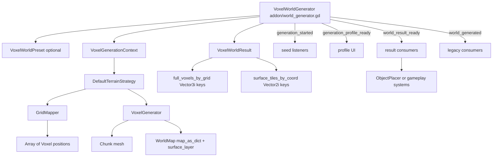

# Reusing the Voxel Hex World Generator

This guide explains the current generator architecture, how to use it in this project, and how to move it into another Godot 4 project.

The generator is now built around a stable runtime result object:

- Full voxel map: `Dictionary` keyed by `Vector3i`.
- Surface map: `Dictionary` keyed by `Vector2i`.
- Result wrapper: `VoxelWorldResult`, a `RefCounted` runtime object.
- Surface record: `VoxelSurfaceTile`, a `RefCounted` runtime object.

This shape is intentional. The map can have negative coordinates, multiple footprint shapes, holes, air, and variable height. Sparse dictionaries fit that better than 3D arrays.

## Current Status

Implemented:

- `WorldGenerator` still generates the current terrain mesh.
- `WorldMap` and `VoxelData` remain autoloads.
- `world_generated(chunk, voxel_count)` is still emitted for old listeners.
- `world_result_ready(result)` is emitted for new systems.
- `VoxelWorldResult` exposes full voxel data, surface tile data, seed, profile, noise range, metadata, and chunk reference.
- Generation uses a per-run `RandomNumberGenerator` context.
- Atlas dimensions come from `VoxelAtlasSettings`.
- Terrain generation is wrapped by a resource strategy interface.
- Weight output is generic and stored in `VoxelSurfaceTile.weights`.
- `ObjectPlacer` can consume `VoxelWorldResult` and still has old-signal fallback.

Not finished yet:

- Core worldgen files now live in `addons/voxel_worldgen`.
- Old `scripts/WorldGen/...` and `scripts/Global/...` paths are compatibility wrappers for this project.
- Placement is not split into a separate addon folder yet.
- Terrain type/passability rules are still mostly inside `VoxelGenerator`.
- `VoxelWorldPreset.write_to_world_map` is reserved for later; current generation still writes to `WorldMap`.

## Architecture

For a larger component map with sequence, signal, result, and future addon boundary diagrams, see [WORLDGEN_ARCHITECTURE.md](WORLDGEN_ARCHITECTURE.md).



## Required Autoloads

When using the addon, enable **Project Settings > Plugins > Voxel Worldgen**. The plugin adds these autoloads if they are missing:

- `VoxelData` -> `res://addons/voxel_worldgen/autoloads/voxel_data.gd`
- `WorldMap` -> `res://addons/voxel_worldgen/autoloads/world_map.gd`

This project still keeps compatibility autoload paths:

- `VoxelData` -> `res://scripts/Global/voxel_data.gd`
- `WorldMap` -> `res://scripts/Global/world.gd`

`Debugger` is optional.

`WorldMap` is still the runtime source of truth during generation. `VoxelWorldResult` is the clean output contract for other systems.

## Required Files

For another project, copy the whole addon folder:

- `addons/voxel_worldgen`

The addon contains:

- `world_generator.gd`
- autoload scripts in `autoloads/`
- core mapper/data scripts in `core/`
- runtime result classes in `runtime/`
- settings and preset resources in `resources/`
- terrain strategies in `terrain/`
- voxel mesh/runtime classes in `voxel/`
- weight strategies in `weights/`
- a demo scene and resources in `demo/`

For Godot 4.4+ projects, keep any generated `.gd.uid` files with the addon when they exist. They help preserve scene/resource references.

The old `scripts/WorldGen/...` files in this repo are only compatibility wrappers. Do not copy them for a fresh project unless you also need old project paths.

Optional gameplay/UI files:

- `scripts/WorldGen/object_placer.gd`
- `scripts/WorldGen/generation_report_label.gd`
- `scripts/interaction.gd`
- `scripts/pathfinder.gd`
- `scripts/unit.gd`
- `scripts/unit_data.gd`

## Required Assets And Resources

At minimum, you need:

- One `GenerationSettings` resource, for example `Resources/GenerationSettings/test.tres`.
- One material assigned to `GenerationSettings.material`.
- A terrain texture atlas that matches `VoxelData.tile_map`.
- A scene with one generator node and one `Node3D` used as `chunks_root`.

Optional resources:

- `VoxelWorldPreset`
- `VoxelAtlasSettings`
- `DefaultTerrainStrategy`
- `SettlementWeightStrategy`
- `NoVoxelWeightStrategy`

## Quick Start In This Project

1. Open `scenes/GameScene.tscn`.
2. Select `Builder/WorldGenerator`.
3. Assign:
   - `settings`
   - `chunks_root`
4. Leave `terrain_strategy` empty to use `DefaultTerrainStrategy`.
5. Leave `atlas_settings` empty to use default atlas dimensions.
6. Leave `weight_strategies` empty if no generic weights are needed.
7. Run the scene.

By default, generation emits:

- `generation_started(seed_used)`
- `generation_profile_ready(profile)`
- `world_result_ready(result)`
- `world_generated(chunk, voxel_count)`

The old placement path still works because `ObjectPlacer` can listen to the result signal and still has old signal fallback.

## Quick Start In A New Project

1. Copy `addons/voxel_worldgen` into the new project.
2. Enable the `Voxel Worldgen` plugin.
3. Create a scene with:
   - `VoxelWorldGenerator` node using `addons/voxel_worldgen/world_generator.gd`
   - `Chunks` node using `Node3D`
4. Assign `WorldGenerator.chunks_root` to `Chunks`.
5. Assign a `VoxelWorldPreset` or a `GenerationSettings` resource.
6. Assign a material in `GenerationSettings.material`.
7. Confirm `VoxelData.tile_map` matches your atlas.
8. Run generation once with placement disabled.
9. Add listeners after terrain generation works.

## WorldGenerator Public API

Path: `addons/voxel_worldgen/world_generator.gd`

### Exports

- `preset: Resource`
  Optional `VoxelWorldPreset`. Can fill settings, atlas, terrain strategy, weights, output options, seed, and metadata.

- `settings: GenerationSettings`
  Terrain knobs such as map shape, radius, height, noise, voxel size, material, and placement toggles.

- `chunks_root: Node3D`
  Parent that receives generated `Chunk` nodes.

- `atlas_settings: Resource`
  Optional `VoxelAtlasSettings`. If empty, defaults are used.

- `terrain_strategy: Resource`
  Optional terrain strategy. If empty, `DefaultTerrainStrategy` is used.

- `weight_strategies: Array[Resource]`
  Optional list of `VoxelWeightStrategy` resources. Each strategy writes one channel into each surface tile's `weights` dictionary.

- `chunks_root_path: NodePath`
  Fallback path to find `chunks_root`.

- `generate_on_ready: bool`
  Auto-run generation in `_ready()`.

- `generation_seed: int`
  Seed override. If `0`, the generator reads `preset.generation_seed`, then `settings.map_seed`. If all are `0`, it generates a random seed and reports it in the result.

- `output_surface_data: bool`
  If true, result includes `surface_tiles_by_coord`.

- `output_full_voxel_data: bool`
  If true, result includes `full_voxels_by_grid`.

- `include_mesh_chunk: bool`
  If true, result includes the generated `Chunk` reference.

- `include_debug_profile: bool`
  If true, result includes the timing profile.

### Methods

- `regenerate_world()`
  Clears old map/chunk state, prepares context, and schedules generation.

- `generate_world()`
  Runs generation immediately. Usually called through `regenerate_world()`.

- `clear_world()`
  Clears `WorldMap`, cached result, context, and generated chunk children.

- `get_last_result() -> VoxelWorldResult`
  Returns the most recent result.

- `get_surface_tile_at_coord(coord: Vector2i) -> VoxelSurfaceTile`
  Looks up a top surface tile from the latest result.

- `get_voxel_at_grid_coord(coord: Vector3i) -> Voxel`
  Looks up a full voxel from the latest result.

### Signals

- `generation_started(seed_used: int)`
  Emitted after the seed is resolved and before terrain generation starts.

- `generation_profile_ready(profile: Dictionary)`
  Emitted with timing information.

- `world_result_ready(result: VoxelWorldResult)`
  Preferred signal for gameplay systems.

- `world_generated(chunk: Chunk, voxel_count: int)`
  Legacy signal. Keep this for old systems.

## Generation Flow

1. `regenerate_world()` resolves dependencies.
2. `apply_preset()` copies preset values into the generator.
3. `clear_world()` clears old runtime state.
4. `prepare_generation_context()` builds `VoxelGenerationContext`.
5. Seed is resolved:
   - `generation_seed`
   - `preset.generation_seed`
   - battlefield seed derived from preset parent context
   - `settings.map_seed`
   - random generated seed
6. `generation_started(seed_used)` is emitted.
7. `DefaultTerrainStrategy.generate(context)` runs unless another terrain strategy is assigned.
8. `GridMapper` builds all voxel positions.
9. `VoxelGenerator` shapes voxels, assigns terrain type, builds mesh, and writes `WorldMap`.
10. The generated `Chunk` is added to `chunks_root`.
11. `Chunk.init_chunk()` builds collider and layer lookup data.
12. `VoxelWorldResult` is built from `WorldMap`.
13. Weight strategies write into `VoxelSurfaceTile.weights`.
14. Signals emit in this order:
    - `generation_profile_ready`
    - `world_result_ready`
    - `world_generated`

## Result Data Model

### VoxelWorldResult

Path: `addons/voxel_worldgen/runtime/voxel_world_result.gd`

Fields:

- `seed_used: int`
- `settings: GenerationSettings`
- `chunk: Chunk`
- `voxel_count: int`
- `surface_count: int`
- `full_voxels_by_grid: Dictionary`
- `surface_tiles_by_coord: Dictionary`
- `generation_profile: Dictionary`
- `noise_range: Vector2`
- `metadata: Dictionary`

`full_voxels_by_grid` mirrors `WorldMap.map_as_dict` when `output_full_voxel_data` is true.

`surface_tiles_by_coord` is keyed by `Vector2i` and contains `VoxelSurfaceTile` values.

### VoxelSurfaceTile

Path: `addons/voxel_worldgen/runtime/voxel_surface_tile.gd`

Fields:

- `coord_2d: Vector2i`
- `top_grid_coord: Vector3i`
- `world_position: Vector3`
- `height: int`
- `terrain_type: int`
- `is_empty: bool`
- `passable: bool`
- `placeable: bool`
- `weights: Dictionary`
- `metadata: Dictionary`
- `source_voxel: Voxel`

`coord_2d` comes from `Voxel.grid_position_xz`.

`top_grid_coord` comes from `Voxel.grid_position_xyz`.

`metadata` currently includes:

- `noise`
- `air_probability`
- `buffer`
- `water`
- `surface_voxel`

`source_voxel` is a runtime reference. Treat the result as valid until the next regeneration.

## Consuming Results

Connect to `world_result_ready`:

```gdscript
@export var world_generator: Node

func _ready() -> void:
	if world_generator != null:
		world_generator.world_result_ready.connect(_on_world_result_ready)


func _on_world_result_ready(result: VoxelWorldResult) -> void:
	var coord := Vector2i(0, 0)
	var tile := result.surface_tiles_by_coord.get(coord) as VoxelSurfaceTile
	if tile == null:
		return

	print(tile.height)
	print(tile.world_position)
	print(tile.weights)
```

Use the generator helper methods when you already have a generator reference:

```gdscript
var tile := world_generator.get_surface_tile_at_coord(Vector2i(0, 0))
var voxel := world_generator.get_voxel_at_grid_coord(Vector3i(0, 2, 0))
```

## VoxelWorldPreset

Path: `addons/voxel_worldgen/resources/voxel_world_preset.gd`

Use a preset when you want one reusable resource that describes a generation role.

Fields:

- `generation_seed`
- `generation_settings`
- `atlas_settings`
- `terrain_strategy`
- `weight_strategies`
- `include_full_voxel_map`
- `include_surface_map`
- `include_mesh_chunk`
- `include_debug_profile`
- `write_to_world_map` reserved for later
- `metadata_defaults`
- `generation_role`
- `parent_world_seed`
- `parent_surface_coord`
- `battlefield_size`
- `battlefield_context`

For overworld generation:

1. Create a `VoxelWorldPreset`.
2. Assign `generation_settings`.
3. Optionally assign atlas, terrain, and weight strategies.
4. Set `generation_role` to `OVERWORLD`.
5. Assign the preset to `WorldGenerator.preset`.

For battlefield generation:

1. Create a `VoxelWorldPreset`.
2. Set `generation_role` to `BATTLEFIELD`.
3. Set `parent_world_seed`.
4. Set `parent_surface_coord`.
5. Add encounter details to `battlefield_context`.
6. Leave `generation_seed` at `0` if you want a derived battlefield seed.

The generator derives a stable seed from:

- parent world seed
- parent surface coordinate
- battlefield context dictionary

This means the same overworld encounter can regenerate the same battlefield.

## Deterministic RNG

Path: `addons/voxel_worldgen/runtime/voxel_generation_context.gd`

Each generation run gets a `VoxelGenerationContext`:

- `settings`
- `requested_seed`
- `seed_used`
- `random`
- `atlas_settings`
- `interval`
- `metadata`

`GridMapper` uses `context.random` for variance. This replaces global `randf_range`.

Rules:

- Same nonzero seed gives the same terrain signature.
- Seed `0` still means random generation.
- Random generation reports the actual `seed_used`.
- Subterrain presets can derive seeds from parent context.

## Atlas Settings

Path: `addons/voxel_worldgen/resources/voxel_atlas_settings.gd`

Fields:

- `atlas_resolution`
- `tile_size`
- `tile_stride`
- `tile_margin`

Defaults match the current atlas:

```gdscript
atlas_resolution = Vector2i(512, 512)
tile_size = Vector2i(16, 16)
tile_stride = Vector2i(18, 18)
tile_margin = Vector2i(5, 5)
```

`VoxelGenerator` reads these values when calculating UVs.

Terrain type to tile mapping still lives in `VoxelData.tile_map`. Moving that into a material palette resource is a later step.

## Terrain Strategies

Base path: `addons/voxel_worldgen/terrain/voxel_terrain_strategy.gd`

Default path: `addons/voxel_worldgen/terrain/default_terrain_strategy.gd`

`DefaultTerrainStrategy` preserves the old flow:

1. Create `GridMapper`.
2. Pass in the generation RNG.
3. Calculate voxel positions.
4. Create `VoxelGenerator`.
5. Pass in atlas settings.
6. Build chunk.
7. Return:

```gdscript
{
	"chunk": chunk,
	"voxels": voxels
}
```

Custom terrain strategies must implement:

```gdscript
func generate(context) -> Dictionary:
	return {
		"chunk": chunk,
		"voxels": voxels
	}
```

Use this for battlefield terrain, alternate map shapes, biome-specific generation, or test generators.

## Weight Strategies

Base path: `addons/voxel_worldgen/weights/voxel_weight_strategy.gd`

Built-in strategies:

- `NoVoxelWeightStrategy`
- `SettlementWeightStrategy`

Each strategy provides:

```gdscript
func get_weight_id() -> StringName:
	return &"settlement"


func calculate_weight(surface_tile: VoxelSurfaceTile, result: VoxelWorldResult, settings: GenerationSettings) -> float:
	return 0.0
```

Results are stored like this:

```gdscript
surface_tile.weights[strategy_id] = calculated_weight
```

Example:

```gdscript
tile.weights[&"settlement"] = 0.72
tile.weights[&"battlefield_cover"] = 0.44
```

`SettlementWeightStrategy` uses center distance, voxel noise, and solidity. It is generic enough for settlement-like placement, not hardcoded into terrain generation.

If a strategy returns `&"village"` as its weight id, `WorldGenerator` temporarily mirrors that value into `Voxel.village_weight` for legacy compatibility.

## Object Placement

Path: `scripts/WorldGen/object_placer.gd`

`ObjectPlacer` is still in the worldgen folder for now, but it is already moving toward the placement-addon shape.

Current behavior:

- Prefers `world_result_ready(result)`.
- Falls back to `world_generated(chunk, voxel_count)`.
- Reads placeable tiles from `VoxelWorldResult.surface_tiles_by_coord` when available.
- Falls back to `WorldMap.surface_layer` when result surface data is disabled or missing.
- Reads `result_weight_id` from `VoxelSurfaceTile.weights` when present.
- Falls back to its old placeholder village scoring when no result weights exist.

Important exports:

- `prefer_world_result_signal`
- `result_weight_id`
- `world_generator`
- `world_generator_path`
- `auto_connect`
- village/unit spawn settings
- village/unit scenes

Recommended placement flow for new systems:

1. Listen to `world_result_ready`.
2. Read `result.surface_tiles_by_coord`.
3. Use tile fields and weight channels.
4. Instantiate gameplay scenes outside the generator.
5. Store any placed-object state outside worldgen.

## GenerationSettings Controls

Path: `addons/voxel_worldgen/resources/generation_settings.gd`

Important fields:

- `map_shape`
- `map_seed`
- `radius`
- `max_height`
- `terrace_steps`
- `remove_overhang`
- `noise_height_bias`
- `ground_to_air_ratio`
- `flat_buffer`
- `noise`
- `variance`
- `voxel_size`
- `voxel_height`
- `shading`
- `material`
- `draw_bottom`
- `solid_first_layer`
- `spawn_villages_and_units`
- `map_edge_buffer`
- `spacing`

`map_seed` is still supported. `WorldGenerator.generation_seed` and `VoxelWorldPreset.generation_seed` can override it.

## Migration Checklist

For a new project:

1. Copy `addons/voxel_worldgen`.
2. Copy or recreate `GenerationSettings`.
3. Copy or recreate material and atlas.
4. Enable the plugin so `VoxelData` and `WorldMap` autoloads are added.
5. Create a scene with `VoxelWorldGenerator` and `Chunks`.
6. Assign `chunks_root`.
7. Assign either `settings` directly or a `VoxelWorldPreset`.
8. Run with `spawn_villages_and_units = false`.
9. Verify mesh, collision, and `world_result_ready`.
10. Add result listeners.
11. Add `ObjectPlacer` or your own placement system.
12. Add weight strategies only after basic generation works.
13. Add custom terrain strategies only after default generation works.

## Common Pitfalls

### Missing Autoloads

If `WorldMap` or `VoxelData` is missing, generation cannot run correctly.

### Missing chunks_root

`WorldGenerator` aborts if it cannot find `chunks_root`.

Assign it directly when possible. Use `chunks_root_path` only as fallback.

### Class Names Not Registered Yet

After copying new scripts into a Godot 4.4+ project, open the project once so Godot creates script class cache and `.gd.uid` files. If a scene fails to recognize a new `class_name`, reload the project.

### Atlas Looks Wrong

Check:

- `VoxelAtlasSettings`
- `VoxelData.tile_map`
- assigned material texture

Atlas dimensions and tile coordinates must match.

### Placement Runs But Spawns Nothing

Check:

- `GenerationSettings.spawn_villages_and_units`
- `ObjectPlacer.world_generator`
- `ObjectPlacer.prefer_world_result_signal`
- `ObjectPlacer.village`
- `ObjectPlacer.proto_unit`
- `result.surface_tiles_by_coord` is not empty

### Result References Go Stale

`VoxelWorldResult` contains runtime references:

- `Chunk`
- `Voxel`
- dictionaries with vector keys

Use a result until the next regeneration. After regeneration, listen for the new result and discard old references.

## Extension Examples

### Custom Weight Strategy

```gdscript
extends "res://addons/voxel_worldgen/weights/voxel_weight_strategy.gd"
class_name CoverWeightStrategy

func get_weight_id() -> StringName:
	return &"battlefield_cover"


func calculate_weight(surface_tile: VoxelSurfaceTile, result: VoxelWorldResult, settings: GenerationSettings) -> float:
	if not surface_tile.passable:
		return 0.0
	return clampf(float(surface_tile.height) / float(maxi(settings.max_height, 1)), 0.0, 1.0)
```

Assign it to `WorldGenerator.weight_strategies` or `VoxelWorldPreset.weight_strategies`.

### Custom Terrain Strategy

```gdscript
extends "res://addons/voxel_worldgen/terrain/voxel_terrain_strategy.gd"
class_name FlatTestTerrainStrategy

func generate(context) -> Dictionary:
	var mapper = GridMapper.new()
	mapper.random = context.random
	var voxels = mapper.calculate_map_positions()

	var generator = VoxelGenerator.new()
	generator.atlas_settings = context.atlas_settings
	var chunk = generator.generate_chunk(voxels, context.interval)

	return {
		"chunk": chunk,
		"voxels": voxels
	}
```

This example still uses the old mapper/generator internally. A real strategy can replace either part.

## Current Limitations

- The core generator is packaged as `addons/voxel_worldgen`.
- `ObjectPlacer` still lives under `scripts/WorldGen`.
- `VoxelGenerator.assign_type()` still contains hardcoded terrain assignment rules.
- `VoxelData.tile_map` still owns terrain type to atlas tile mapping.
- `VoxelWorldPreset.write_to_world_map` is reserved for later.
- Result dictionaries are runtime data, not save/export data.

## Recommended Next Steps

1. Move `ObjectPlacer` into a placement module/addon.
2. Convert terrain assignment into terrain rule resources.
3. Move `VoxelData.tile_map` into a palette/material resource.
4. Replace old scene script paths with addon paths when you are ready to remove wrappers.
5. Add more demo presets for battlefield and overworld variants.
