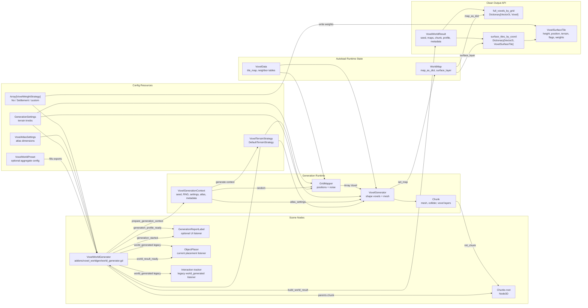
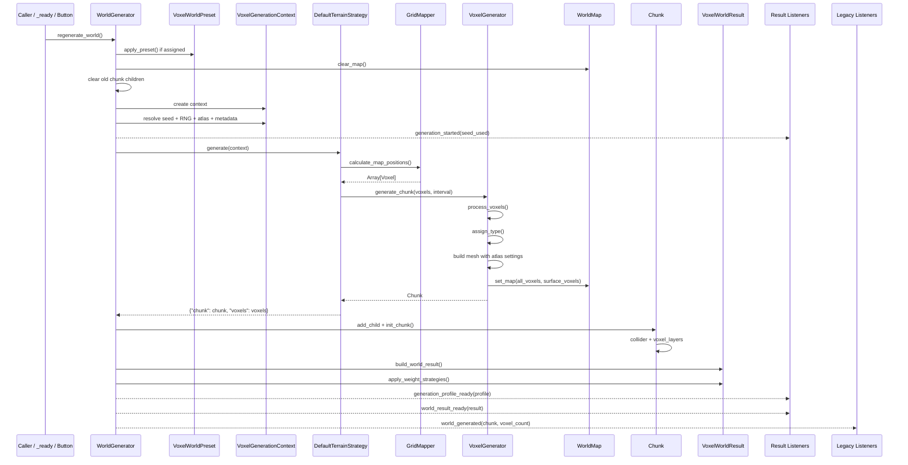
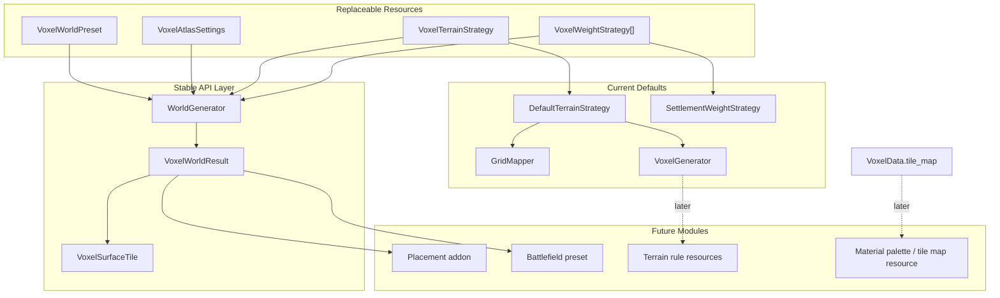

# Voxel Worldgen Architecture Map

This document is the visual companion to [REUSE_GUIDE.md](REUSE_GUIDE.md). It shows how the addon generator pieces are wired together and where the remaining placement boundary should land.

## Component Wiring



## Generation Sequence



## Result Data Shape

```mermaid
flowchart TD
    Result["VoxelWorldResult"]

    Result --> Seed["seed_used: int"]
    Result --> Settings["settings: GenerationSettings"]
    Result --> ChunkRef["chunk: Chunk"]
    Result --> Counts["voxel_count / surface_count"]
    Result --> Profile["generation_profile: Dictionary"]
    Result --> Noise["noise_range: Vector2"]
    Result --> Metadata["metadata: Dictionary"]

    Result --> Full["full_voxels_by_grid"]
    Full --> FullKey["key: Vector3i"]
    Full --> Voxel["value: Voxel"]

    Result --> Surface["surface_tiles_by_coord"]
    Surface --> SurfaceKey["key: Vector2i"]
    Surface --> Tile["value: VoxelSurfaceTile"]

    Tile --> Coord["coord_2d: Vector2i"]
    Tile --> Top["top_grid_coord: Vector3i"]
    Tile --> Pos["world_position: Vector3"]
    Tile --> Height["height: int"]
    Tile --> Terrain["terrain_type: int"]
    Tile --> Flags["is_empty / passable / placeable"]
    Tile --> Weights["weights: Dictionary"]
    Tile --> TileMetadata["metadata: Dictionary"]
    Tile --> Source["source_voxel: Voxel"]

    Voxel --> Source
```



## Signal Wiring

```mermaid
flowchart LR
    WG["WorldGenerator"]

    WG -->|generation_started(seed_used)| SeedUI["Seed UI / debug log"]
    WG -->|generation_profile_ready(profile)| ProfileUI["GenerationReportLabel"]
    WG -->|world_result_ready(result)| Placement["ObjectPlacer / future placement addon"]
    WG -->|world_result_ready(result)| Battlefield["Battlefield generator request builder"]
    WG -->|world_result_ready(result)| Systems["Roads / loot / biome markers / units"]
    WG -->|world_generated(chunk, voxel_count)| Interaction["Interaction tracker"]
    WG -->|world_generated(chunk, voxel_count)| Legacy["Any old listeners"]

    Placement -->|reads| Surface["result.surface_tiles_by_coord"]
    Placement -->|reads| Weights["tile.weights[result_weight_id]"]
    Placement -->|spawns scenes| SceneTree["Villages / units / props"]
```

## Extension Seams



## Addon Boundary Target

```mermaid
flowchart LR
    subgraph WorldgenAddon["Voxel worldgen addon"]
        WG["WorldGenerator"]
        Result["VoxelWorldResult / VoxelSurfaceTile"]
        Preset["VoxelWorldPreset"]
        Terrain["Terrain strategies"]
        Weights["Weight strategies"]
        Atlas["VoxelAtlasSettings"]
        MapData["WorldMap + VoxelData autoloads"]
    end

    subgraph PlacementAddon["Future placement addon"]
        Placement["PlacementManager / ObjectPlacer successor"]
        Rules["Placement rule resources"]
        Scenes["Village / unit / prop scenes"]
    end

    subgraph GameProject["Game project"]
        Overworld["Overworld scene"]
        BattleScene["Battlefield scene"]
        UI["Profile / seed UI"]
        GameSystems["Combat, roads, loot, encounters"]
    end

    WorldgenAddon -->|world_result_ready(result)| PlacementAddon
    PlacementAddon -->|spawned nodes + metadata| GameProject
    WorldgenAddon -->|same generator, different preset| BattleScene
    WorldgenAddon --> Overworld
    WG --> UI
    Result --> GameSystems
```

## Reading The Map

- `WorldGenerator` is the orchestration node.
- `WorldMap` is still the runtime map store during generation.
- `VoxelWorldResult` is the public data contract after generation.
- `DefaultTerrainStrategy` keeps the existing `GridMapper` plus `VoxelGenerator` flow behind a resource interface.
- `VoxelAtlasSettings` removes hardcoded atlas dimensions from the generator path.
- `VoxelWeightStrategy` resources write generic score channels into `VoxelSurfaceTile.weights`.
- `ObjectPlacer` is already result-aware, but it should become a separate placement addon later.
